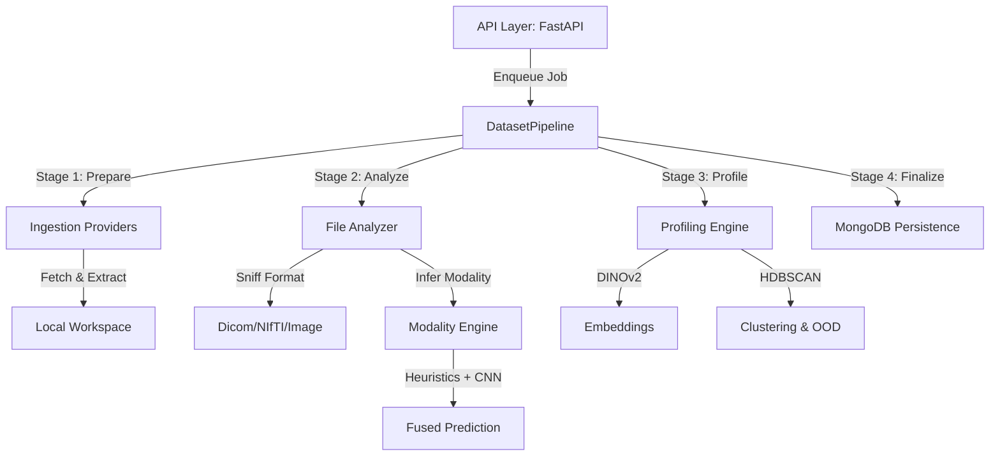

# BioDataMine: Medical Image Analysis & Profiling System – Design Document

This document outlines the architecture, implementation details, and design philosophy of the **BioDataMine** system, as of January 2026.

---

## 1. Project Overview
BioDataMine is an automated platform for ingesting, analyzing, and profiling medical imaging datasets. It solves the "black box" problem of large medical datasets by automatically identifying file formats, imaging modalities, and anatomical structures, while providing deep insights through self-supervised image embeddings and density-based clustering.

## 2. High-Level Architecture
The system follows a modular, pipeline-driven architecture designed for high throughput and extensibility.

## 3. Technology Stack

| Component | Technology |
| :--- | :--- |
| **Backend** | Python 3.10+, FastAPI |
| **Database** | MongoDB (Metadata storage) |
| **Containerization** | Docker, Docker Compose |
| **Image Handling** | Pydicom, Nibabel, OpenCV, Pillow |
| **Deep Learning** | PyTorch, Torchvision, TIMM |
| **Profiling** | DINOv2 (facebookresearch), HDBSCAN, Scikit-learn |
| **Ingestion** | Kaggle API, GitHub API, HTTP/S |

---

## 4. Core Modules

### 4.1. Ingestion Engine (`backend/app/services/ingestion/`)
A provider-based system that resolves various URL types into a local file structure.
- **Providers:**
    - `HttpProvider`: Direct file/zip downloads with basic/token auth support.
    - `KaggleProvider`: Programmatic access to Kaggle datasets via API.
    - `GithubProvider`: Repository zipball extraction.
- **Workspace Management:** Creates ephemeral directories for extraction to prevent cross-dataset pollution.

### 4.2. Dataset Pipeline (`backend/app/services/pipelines/`)
The orchestration layer that manages long-running jobs without blocking the API.
- **DatasetPipeline:** An in-memory async queue and worker loop.
- **Idempotent Upserts:** Uses `bulk_write` with `UpdateOne(upsert=True)` and a unique compound index `(dataset_id, relpath)` to ensure restartability and prevent duplicates.
- **Batch Processing:** Files are processed in parallel with a semaphore-controlled concurrency limit, then flushed to MongoDB in configurable batches.

### 4.3. Modality Inference (`backend/app/services/detection/modality/`)
A hybrid "Fused Vote" engine that combines multiple signals:
- **DICOM Tags:** High-priority modality strings (e.g., `CT`, `MR`).
- **Image Heuristics:** Aspect ratio, grayscale/color detection, intensity histograms, and edge density.
- **File/Folder Patterns:** Matching keywords like `us_`, `axial`, `ultrasound`.
- **OCR (Tesseract):** Detection of technical overlay text (e.g., `MHz`, `kVp`).
- **CNN Probabilities:** Model-based class probabilities (placeholder).

### 4.4. Data Profiling (`backend/app/services/profiling/`)
Moves beyond simple metadata to understand dataset distribution.
- **Embeddings:** Uses **DINOv2 (ViT-B/14)** to extract 768-dimensional self-supervised features.
- **Clustering:** Employs **HDBSCAN** for density-based clustering. Uses L2-normalized Euclidean distance (equivalent to Cosine Similarity) to group similar images and identify outliers (Out-of-Distribution detection).
- **Summary Logic:** Aggregates predictions to flag "Mixed Modality" datasets and report outlier counts.

---

## 5. Data Model (MongoDB)

### `datasets` Collection
Stores high-level metadata and aggregated summaries.
- `summary`: Contains `modality_counts`, `ext_counts`, `mixed_modality` flag, and `outliers`.
- `meta.stage`: Tracks current pipeline progress (`prepare`, `analyze_files`, `finalize`, `failed`).

### `files` Collection
Stores per-file analysis results.
- `relpath`: Relative path within the dataset.
- `modality`: The final fused prediction.
- `meta.modality_model`: Details of the inference (confidence, version, method).
- `embedding`: (Optional/Reference) link to stored feature vectors.

---

## 6. Development & Deployment
- **Dockerized Environment:** The system runs in two containers: `datascan-api` (FastAPI + ML) and `datascan-mongo`.
- **Networking:** Dedicated `datascan-net` for secure inter-container communication.
- **Configuration:** Managed via `.env` and `Pydantic-Settings` for API keys (Kaggle, GitHub, MongoDB).

## 7. Future Roadmap
- **Anatomy Detection:** Integration of RadImageNet/EfficientNet for anatomical site identification.
- **Volumetric Profiling:** Handling 3D NIfTI/DICOM series as single entities in the profiling engine.
- **S3 Integration:** Offloading local files to object storage post-analysis.
- **Interactive Visualizations:** Frontend integration for cluster exploration (t-SNE/UMAP).

